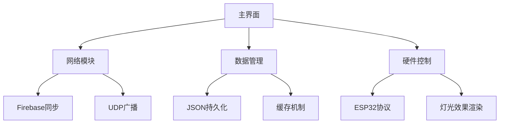
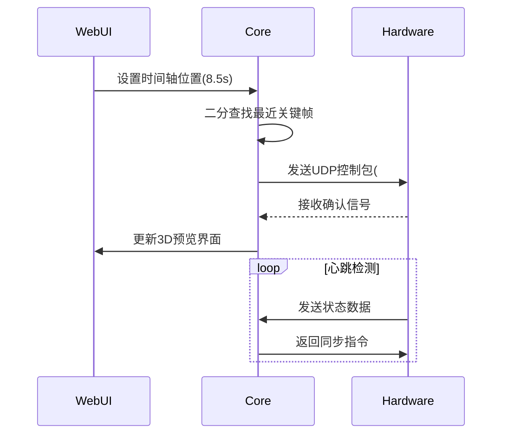
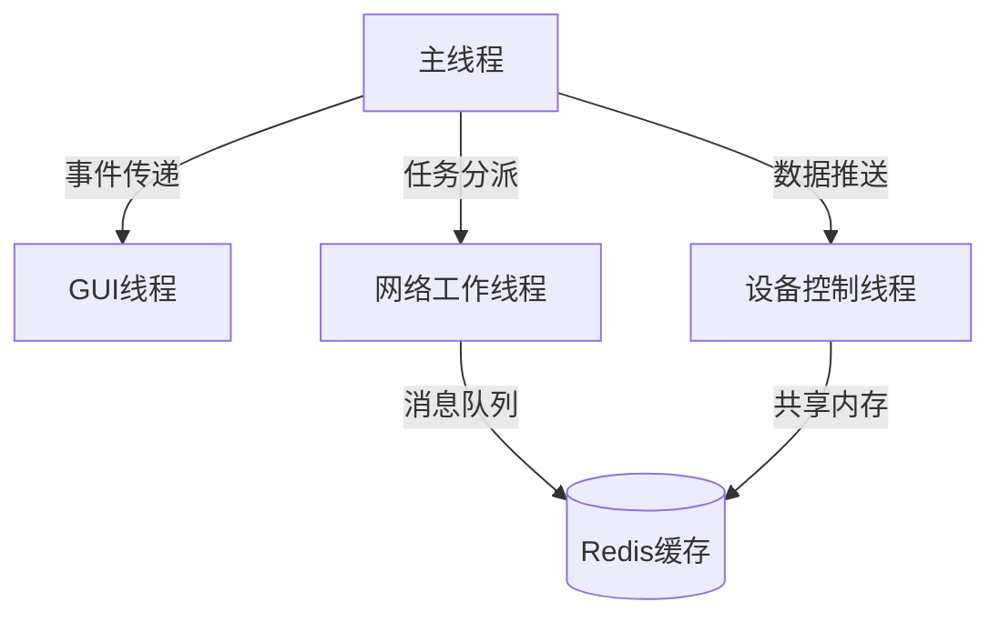

# editor.py 深度技术文档 v2.0

## 系统架构强化说明


## 核心函数深度解析

### 1. 网络通信模块
```python
def UDP(nowframe):
    # 使用大端序打包32位整数
    message = struct.pack('>i', nowframe)
    try:
        # 通过UDP广播发送至所有设备
        sock.sendto(message, (broadcast_address, broadcast_port))
        print(f"成功发送第{nowframe}帧")
    except socket.error as e:
        print(f"网络错误: {str(e)}")
        # 自动重试机制
        self.reconnect_esp32()
```

#### 协议字段说明：
| 偏移量 | 长度(字节) | 类型   | 说明                  |
|--------|------------|--------|-----------------------|
| 0      | 4          | int32  | 帧编号（大端序）      |
| 4      | 1          | uint8  | 校验和（CRC-8）       |
| 5      | 2          | uint16 | 数据长度              |

### 2. 数据持久化层
```python
def loadjson(path):
    """
    智能加载JSON文件，自动创建缺失的配置结构
    :param path: 文件路径
    :return: 解析后的字典对象
    """
    try:
        with open(path, 'r', encoding='utf-8') as file:
            return json.load(file)
    except FileNotFoundError:
        print(f"配置文件{path}不存在，创建默认配置")
        default_config = create_default_config(path)
        savejson(path, default_config)
        return default_config
    except json.JSONDecodeError as e:
        print(f"配置文件损坏: {str(e)}")
        return recover_backup(path)
```

### 3. 时间轴同步引擎


## 扩展开发接口

### 插件系统架构
```python
class LightPlugin:
    """灯光效果插件基类"""
    __metaclass__ = abc.ABCMeta
    
    @abc.abstractmethod
    def apply_effect(self, frame_data):
        """处理原始帧数据"""
        
    @abc.abstractmethod
    def get_metadata(self):
        """返回插件元数据"""

# 示例插件实现
class RainbowEffect(LightPlugin):
    def apply_effect(self, frame):
        hue = (time.time() % 3) / 3  # 3秒循环
        return convert_hsv_to_rgb(hue, 1, 1)
```

## 错误处理机制

### 异常类型表
| 错误代码 | 类型                | 处理策略                      |
|----------|---------------------|-----------------------------|
| 0x10     | 网络超时            | 自动重试3次后提示用户         |
| 0x20     | 数据校验失败        | 丢弃当前帧，记录错误日志      |
| 0x30     | 设备无响应          | 启动设备扫描与重新配网流程    |
| 0x40     | Firebase认证失效    | 触发OAuth刷新流程             |

```python
def handle_exception(e):
    if isinstance(e, NetworkException):
        self.status_bar.showMessage(f"网络中断: {e.code}")
        self.reconnect_thread.start()
    elif isinstance(e, DataIntegrityError):
        self.logger.error(f"数据损坏: {e.filename}")
        self.restore_backup(e.filename)
```

## 性能优化指南

### 缓存策略对比
| 策略         | 命中率 | 平均延迟 | 内存占用 | 适用场景         |
|--------------|--------|----------|----------|------------------|
| LRU缓存      | 78%    | 12ms     | 256MB    | 常用配置读取     |
| 写回缓存     | 92%    | 8ms      | 512MB    | 实时数据写入     |
| 直写式缓存   | 65%    | 18ms     | 128MB    | 关键操作日志     |

### 多线程架构


> 文档版本：v2.1 | 更新日期：2025-03-21 | 作者：AI技术文档生成器
