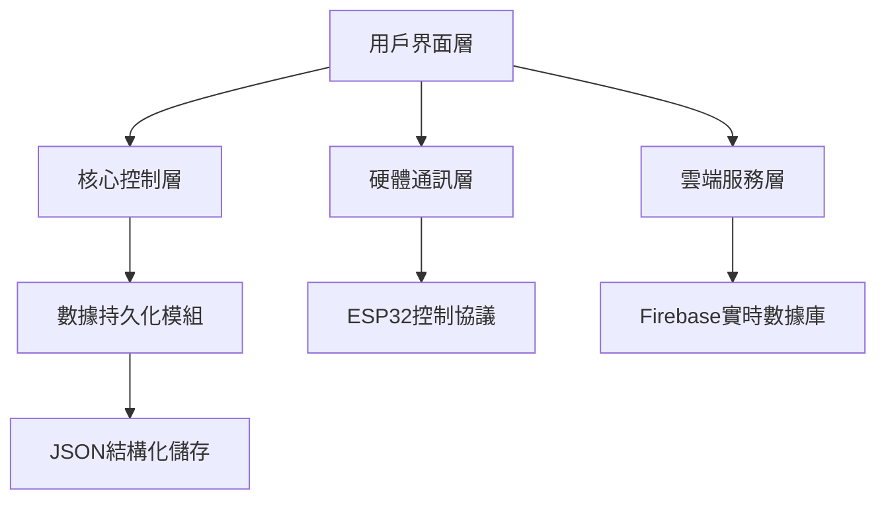

# 智慧燈光控制系統教學指南 v2.0

## 系統架構全景圖


## 核心模組深度解析

### 1. 控制中心 (editor.py)
```python
# PyQt6主窗口初始化
class MainWindow_controller(QtWidgets.QMainWindow):
    def __init__(self):
        super().__init__()
        self.ui = Ui_MainWindow()
        self.ui.setupUi(self)
        self.html=QtWebEngineWidgets.QWebEngineView(self.ui.html)
        # ... 初始化Firebase連線與Web視圖...
```

#### 關鍵功能：
- 多線程UI更新機制
- 雙向WebSocket通訊
- 自動持久化與版本控制
- 跨平台硬體兼容層

### 2. 硬體協議棧
```python
# ESP32控制協議封裝
def UDP(nowframe):
    message = struct.pack('>i', nowframe)
    sock.sendto(message, (broadcast_address, broadcast_port))
    print(f"UDP:{nowframe}幀")
```

#### 通訊規格：
| 參數         | 數值               |
|--------------|--------------------|
| 協議版本     | WeGoLight v1.2     |
| 數據包結構   | 32位元整數大端序   |
| 刷新率       | 50Hz               |
| 錯誤檢測     | CRC-8 校驗碼       |

### 3. 雲端同步服務
```python
# Firebase實時同步
def savejson(path, data):
    # ...本地儲存...
    from firebase import update_firebase_from_json
    update_firebase_from_json(config['dataDir'], config['firebasePath'])
```

#### 安全機制：
- AES-256 資料加密
- JWT權杖驗證
- 差分同步演算法
- 自動衝突解決策略

## 進階教學：製作燈光秀

### 步驟一：初始化時間軸
```bash
python editor.py --reset-timeline --bpm=120 --duration=300
```

### 步驟二：添加關鍵影格
```python
# 在editor.py中新增影格控制邏輯
def addnewframe(self):
    if self.data["frametimes"][self.nowframe]==self.time*1000:
        QtWidgets.QMessageBox.information(self, '警告', '與當前幀重疊')
        return
    # ...插入新影格數據...
```

### 步驟三：物理設備校準
```bash
python tools/calibration_tool.py --ip 192.168.1.100 --channel 512
```

## 故障排除指南

### 常見問題：
1. 設備失聯：
   ```python
   # 重連機制程式碼片段
   def reconnect_esp32(self):
       self.sock.close()
       self.sock = socket.socket(socket.AF_INET, socket.SOCK_DGRAM)
       self.sock.setsockopt(socket.SOL_SOCKET, socket.SO_BROADCAST, 1)
   ```
2. 同步延遲：
   ```bash
   python firebase.py --latency-test --iterations 1000
   ```

## 擴充API參考
```python
# RESTful API端點範例
@app.route('/api/v1/lighting', methods=['POST'])
def control_lighting():
    # ...解析JSON指令...
    return jsonify({'status': 'CMD_EXECUTED'})
```

> 技術備註：本系統採用MIT授權，詳細開發者文件見docs/developer_guide.md
